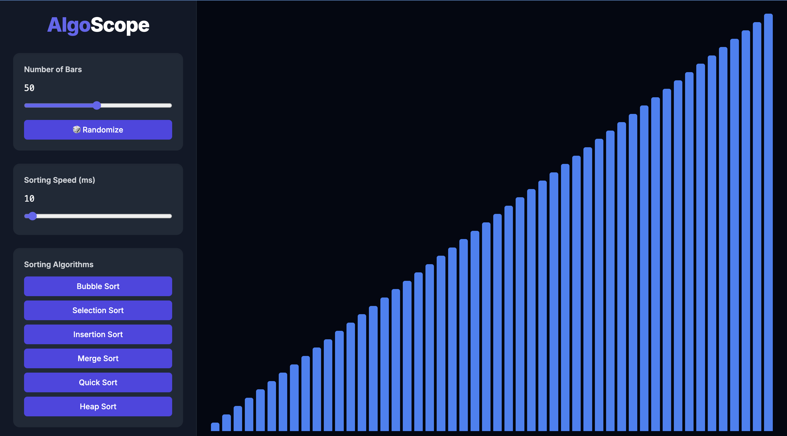

 
# 🔍 AlgoScope

**AlgoScope** is a web-based visualization and benchmarking tool for sorting algorithms. Built with **Next.js**, **TypeScript**, and **Chart.js**, it provides an interactive environment to observe, understand, and compare the performance of algorithms in real time.

Try it live: [algo-scope.vercel.app](https://algo-scope.vercel.app)

---

## 🚀 Features

* 🧠 **Algorithm Visualization**
  Step-by-step animations of **Bubble Sort**, **Selection Sort**, and more — helping users grasp how each algorithm works internally.

* 📈 **Performance Metrics**
  Real-time execution time tracking for each sort. Results are visually plotted on an interactive bar chart.

* 🎛 **Interactive Controls**
  Customize dataset size, sorting speed, and type of algorithm. Instantly update the visualization with new input.

* 🔀 **Randomized Dataset Generator**
  Generate random bar arrays of customizable size to simulate different input scenarios and stress-test algorithms.

* 📤 **Export Tools**
  Download performance charts as **PNG** or export raw data to **CSV** for analysis or reporting.

---

## 📸 Screenshots

><h4>AlgoScope</h4>

---

## 📦 Tech Stack

* **Frontend**: React, Next.js, TypeScript
* **Visualization**: Chart.js, Tailwind CSS
* **Chart Rendering**: react-chartjs-2

---

## 🛠️ Getting Started

1. **Clone the repository**

   ```bash
   git clone [https://github.com/Dsmita03/AlgoScope]
   ```

2. **Install dependencies**

   ```bash
   npm install
   ```

3. **Start the development server**

   ```bash
   npm run dev
   ```

4. Open your browser at [http://localhost:3000](http://localhost:3000)

---

## 🤝 Contributing
Contributions are welcome! Please fork the repository and create a pull request with your changes. For major changes, open an issue first to discuss what you would like to change.
